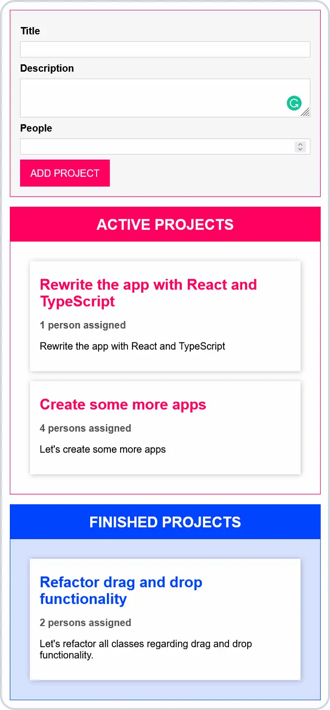

# ⌨️ TypeScript Project Manager

**Drag and drop project manager made with TypeScript.**

## 💻 Screenshot

## 🛠️ Tools and technologies
`TypeScript` `HTML` `CSS` `webpack` `VS Code`

## 🌐 Deployment
Deployed on `Netlify`.

Live preview at [saitama-ts-project-manager.netlify.app](https://saitama-ts-project-manager.netlify.app/).

## 🎓 Related course
This project was created as a part of the [Udemy](https://www.udemy.com/ 'Udemy') course [_Understanding TypeScript - 2023 Edition_](https://www.udemy.com/course/understanding-typescript/ 'See this course on Udemy') by [Maximilian Schwarzmüller](https://twitter.com/maxedapps 'Maximilian Schwarzmüller on Twitter').

By preparing this project I learned a lot of stuff about **TypeScript**.
